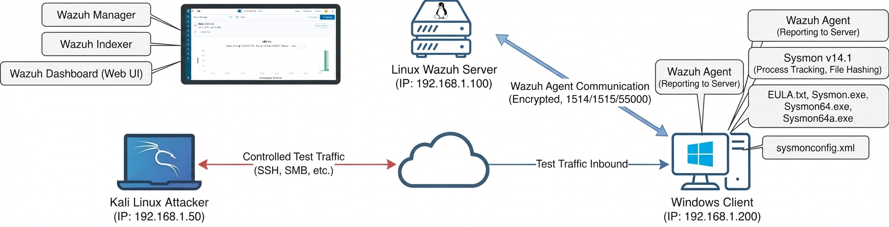

# Architecture du Mini SOC

## 1. Vue d'ensemble
Ce projet met en place un environnement de surveillance minimaliste (Mini SOC) pour collecter, détecter et analyser des événements de sécurité sur un système Windows.

## 2. Schéma d'Architecture

## 3. Composants du Laboratoire
| Rôle | OS / Outil | Description |
| :--- | :--- | :--- |
| **Serveur SIEM** | Ubuntu / Wazuh Server | Centralise la collecte des logs, l'analyse et le dashboard d'alerte. |
| **Machine Cible** | Windows + Sysmon | Machine surveillée générant les événements système et de processus détaillés. |
| **Machine Attaquante** | Kali Linux | Utilisée pour simuler des scénarios d'attaques contrôlés (tests de sécurité). |

## 4. Flux des données
1. L'activité s'exécute sur la machine Windows.
2. Sysmon journalise finement les actions (créations de processus, connexions).
3. Le Wazuh Agent récupère ces flux et les transmet de manière sécurisée au serveur Wazuh.
4. Le serveur analyse, corrèle et déclenche les alertes sur le Dashboard.
